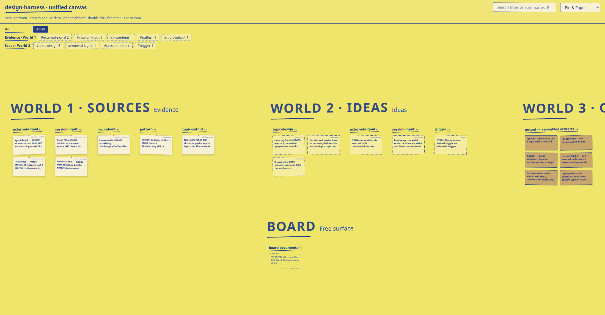

# post-topic-generation

A Claude Code / Codex plugin that **distills X/Twitter topics from a window of recent conversation**, combined with current hotspots.

It only does "conversation → topic": turning the valuable takeaways, tools you discovered, and reflections from your recent AI chats into topics worth posting on X. It does not write the body or publish. Topics come in two kinds:

- **Share-type**: share a tool/person/product that surfaced in the conversation, @-mention its author.
- **Reflection-type**: an original reflection/insight; @-mention a relevant account when one exists.

Hotspots and the conversation are two independent sources — a topic can come from hotspots only, the conversation only, or the overlap of both (overlap is strongest).

## Design

This plugin was designed with **design-harness** — an evidence board where every design decision traces back to sources. The full reasoning (sources → ideas → output) lives under [`docs/design-harness/`](docs/design-harness/).

**▶ [Open the interactive canvas](https://tigerless-labs.github.io/post-topic-generation/canvas.html)** — click a card to light its neighbors, double-click for detail.

[](https://tigerless-labs.github.io/post-topic-generation/canvas.html)

## Quickstart

### Install

**Claude Code:**

```
/plugin marketplace add tigerless-labs/post-topic-generation
/plugin install post-topic-generation@tigerless-labs
```

**Codex (CLI ≥ 0.144):**

```
codex plugin marketplace add tigerless-labs/post-topic-generation
codex plugin add post-topic-generation@tigerless-labs
```

Older Codex versions without the `plugin add` subcommand can install the skill directly (Codex scans `~/.codex/skills`; newer versions also scan `~/.agents/skills`):

```
git clone https://github.com/tigerless-labs/post-topic-generation
mkdir -p ~/.codex/skills
ln -s "$(pwd)/post-topic-generation/skills/x-topic-distiller" ~/.codex/skills/
```

### Update

Refresh the marketplace, then reinstall to pull the latest version.

**Claude Code:**

```
/plugin marketplace update tigerless-labs
/plugin install post-topic-generation@tigerless-labs
```

**Codex (CLI ≥ 0.144):**

```
codex plugin marketplace upgrade tigerless-labs
codex plugin add post-topic-generation@tigerless-labs
```

Direct-clone / symlink installs just need a `git pull` in the cloned repo.

### Use

Trigger it manually in Claude Code / Codex (it never runs on its own):

```
Distill a few X-worthy topics from the last 24 hours of our conversation
```

Change the time range:

```
Come up with X topics from the last 3 days of conversation
```

### Optional: hotspots / finding @-targets (soft-enhance)

Install either tool below to ground topics in current hotspots and auto-find relevant accounts to @. **Topics still work without them** — you just don't get the hotspot grounding.

- `last30days` — recent-opinion aggregation (hotspots)
- [`agent-reach`](https://github.com/Panniantong/Agent-Reach) — multi-platform retrieval / X search (finding @-targets)
