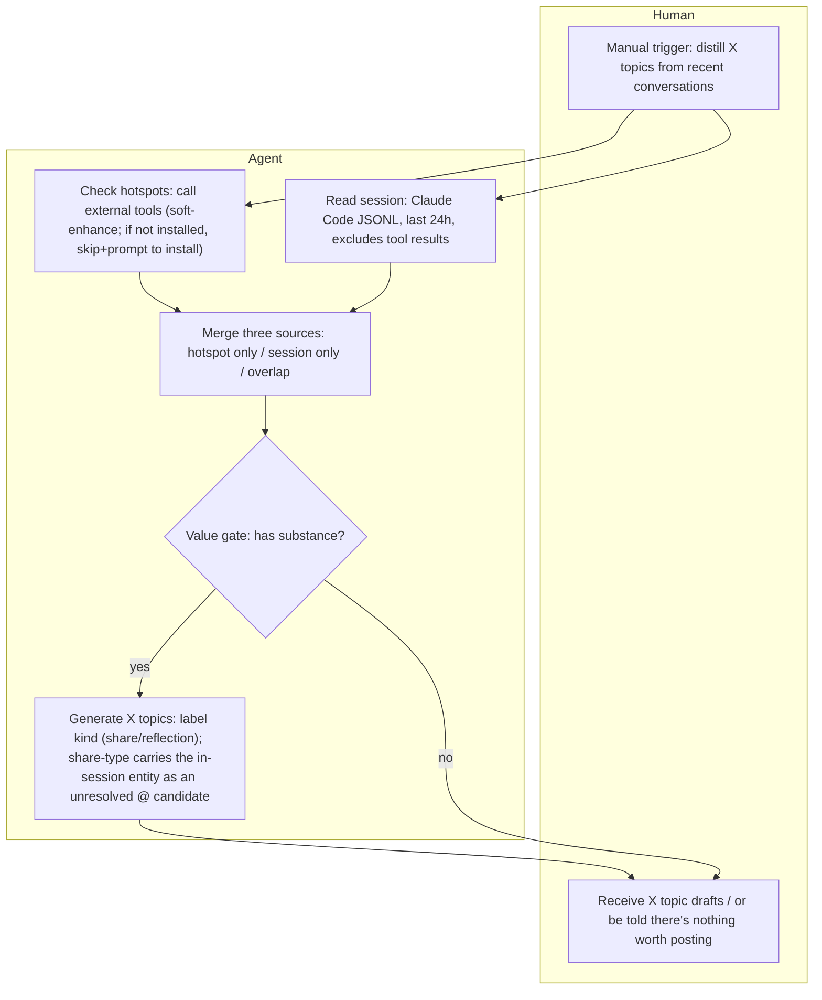
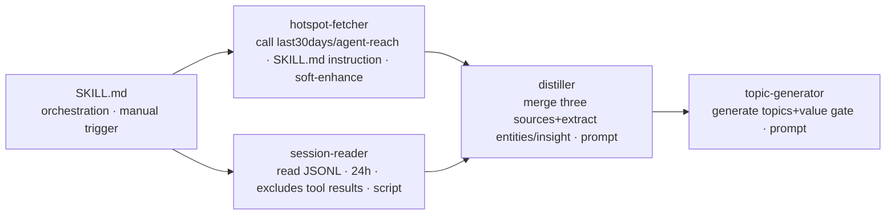
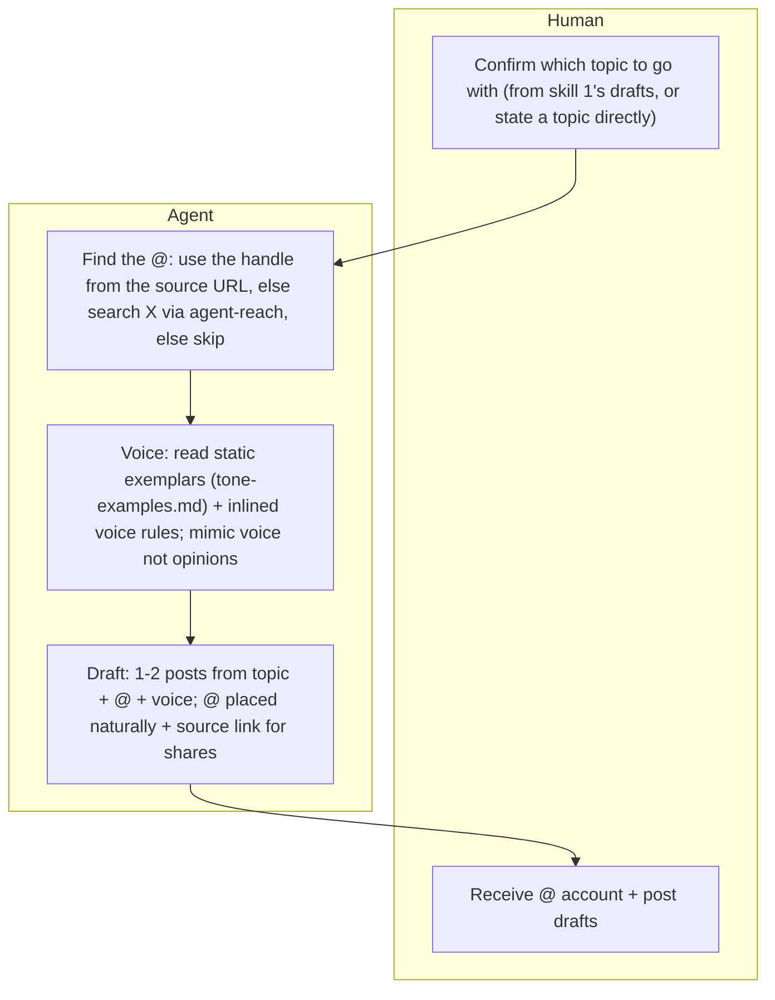
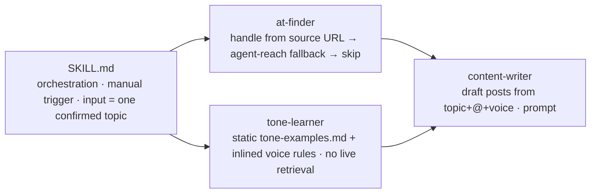

# system — two skills: topic distillation → content generation

The pipeline is split into **two skills**. The interface between them is **one human-confirmed topic**: `x-topic-distiller` turns conversations + hotspots into topic drafts; after the human confirms one, `x-content-generator` turns it into content (@ + voice + draft).

## Skill 1 — x-topic-distiller (conversation → topics)

The hotspot and session are **two independent sources** ([topic-source-independence](../ideas/topic-source-independence.md)): a topic can come from hotspot only / session only / both overlapping.

## Skill 2 — x-content-generator (confirmed topic → content)

Runs **only for the confirmed topic**, never for every draft ([tone-learning-after-confirm](../ideas/tone-learning-after-confirm.md)).

