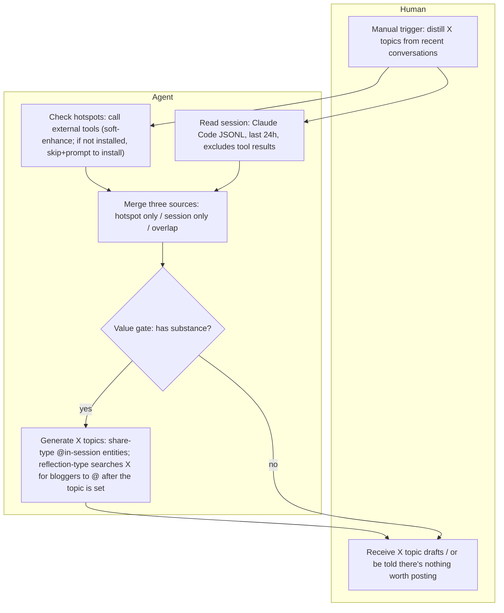
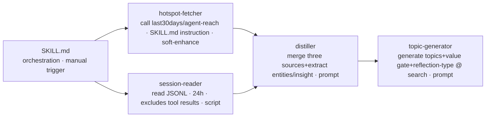

# system — skeleton of the X topic-distillation skill

The hotspot and session are **two independent sources** ([topic-source-independence](../ideas/topic-source-independence.md)): a topic can come from hotspot only / session only / both overlapping.

## Flow (human / agent swimlanes, pure logic)

## Architecture (modules; judgment goes through prompt / deterministic goes through script)

