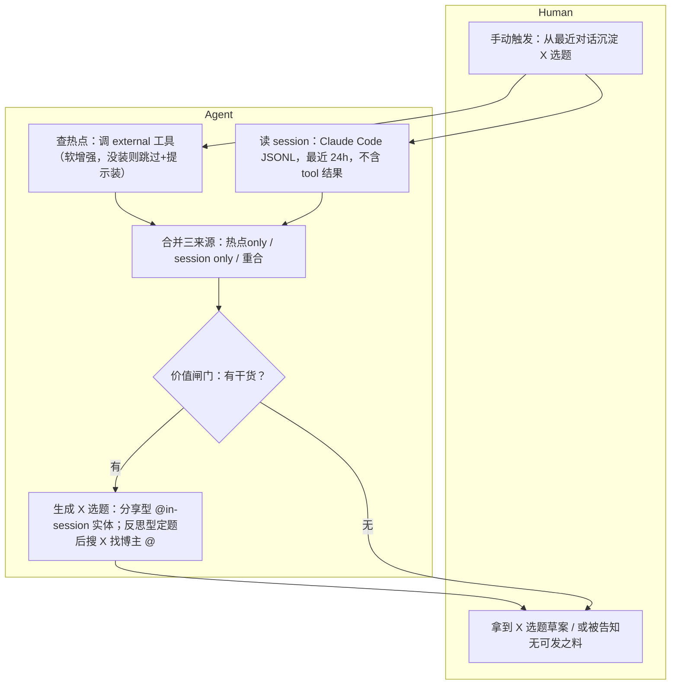
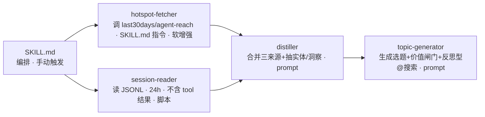

# system — X 选题沉淀 skill 的骨架

热点与 session 是**两个独立来源**（[topic-source-independence](../ideas/topic-source-independence.md)）：选题可来自热点only / session only / 两者重合。

## 流程（human / agent 泳道，纯逻辑）

## 架构（模块，判断走 prompt / 确定性走脚本）

