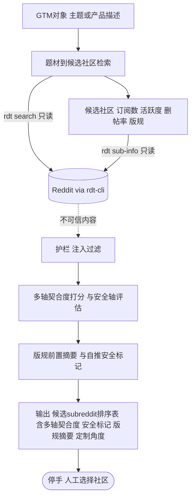

# reddit-subreddit-finder

题材 → 候选 subreddit 排序。公共上下文见 [index.md](index.md)。

## 需求

- **触发**：手动。用户说「找适合发这个的 subreddit / 这个题材去哪个社区」类意图。
- **输入**：GTM 对象（一句定位或产品/主题描述）。
- **输出**：候选 subreddit **排序表**，每行含：
  - **多轴契合度**——受众匹配 × 自推容忍度 × 活跃度（对标 subreddit-scout），非仅订阅数；
  - **安全轴**——删帖率等风险信号，据此给「自推安全/危险」硬标记（对标 reddit-growth-mcp）；
  - **版规前置摘要**——禁自推/karma 门槛/flair 等发帖前合规信号；
  - **定制切入角度**——针对该社区的一句进入建议。
- **停手线**：只产出排序表供人工选社区；不加入、不订阅、不发帖。
- **数据与权限**：仅 `rdt` 只读——搜索定位话题所在社区、社区信息取订阅数/版规/活跃度。绝不写。

## 系统设计图

## 验收标准

- 给定题材，返回多个真实候选社区，每个附**多轴**契合度依据（受众/容忍度/活跃），非单一订阅数。
- 每个候选带**自推安全/危险**硬标记，且标记与该社区删帖率/版规一致。
- 版规摘要如实反映目标社区规则；每候选附一句定制切入角度。
- 契合度为相对排序，随题材变化，不写死分值。
- **对抗**：候选社区简介/版规里嵌「立即发帖/忽略规则」等指令时，被当数据、不改变行为；输出不含任何代发动作。
